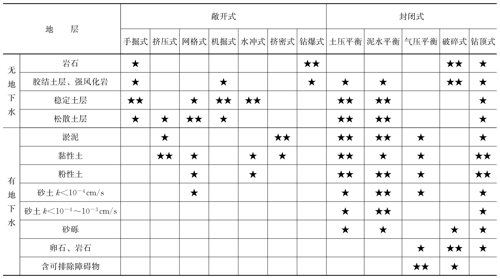
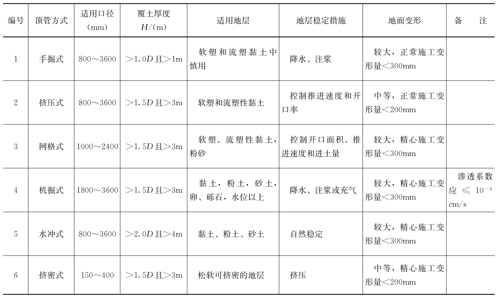
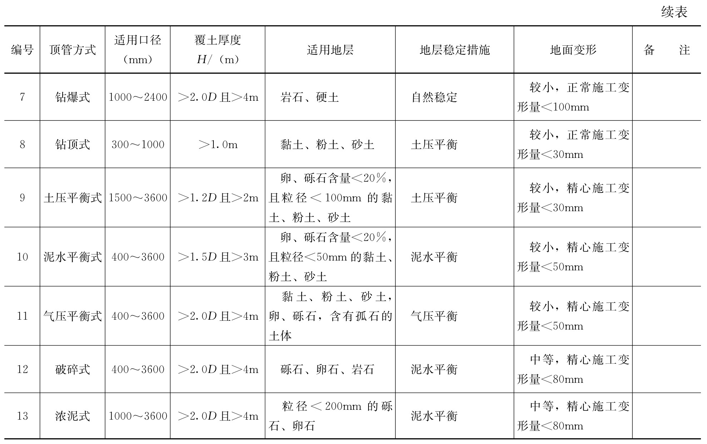

# 顶管施工设计影响因素

表管道位置确定

1. 土质对顶管的影响
   * 可以在各种土质中进行顶管施工，包括淤泥质土、黏土、粉土、砂土以及卵石、砾石、岩石；
   * 在不同的土质中施工，需选择适宜的顶管施工方式与适宜的顶管设备。
2. 管道间距对顶管的影响
   1. 顶进管道与现况管道相互平行时的水平净距应根据土质、管道直径、管道类型和管道埋置深度等因素确定，通常宜大于1倍顶进管道的外径；
   2. 顶进管道与现况管道空间交叉时的净距：顶进钢管时，不宜小于0.5倍管道外径，且不宜小于1.0m；顶进钢筋混凝土管时，不宜小于1倍管道外径，且不宜小于2.0m；
   3. 平行管道同时顶进施工时，相邻管间最小净距应根据地质条件、顶进方法和施工顺序等因素确定，通常宜大于较大管道的外径；不同埋深的管道顶进时，宜先顶进埋深较大的管道；不同口径管道顶进时，宜先顶进管断面较大的管道；
   4. 当净距不能满足上述要求时，应采取土体加固、管道隔离等相应措施，对现况顶进管道与现况地下管线的间距，还应满足地下管线管理单位的要求。
3. 管道环境的影响
   1. 顶进管道须避开地下障碍物的影响范围；
   2. 穿越河道时，须布置在河床的冲刷线以下，并应满足河道规划要求；
   3. 穿越道路、构筑物时，应满足道路、构筑物的保护需求；
   4. 顶管施工对周边建（构）筑物的影响应做出评估，并提出相应的控制标准、防护措施，并与管理单位协商、沟通，满足相关管理规定；必要时，做出顶管穿越安全评估报告；
   5. 确定管道位置时，还应考虑顶管工作坑与周边建（构）筑物之间的安全距离。
4. 管顶覆土厚度的影响
   1. 在不稳定土层中，管顶覆土宜大于管道外径的1.5倍，并应大于1.5m；
   2. 穿越河流时，管顶覆土不宜小于外径的1.5倍，且不宜小于2.5m；
   3. 有地下水地区或穿越河流时，管顶覆土厚度尚应满足管道抗浮要求；
   4. 气压平衡式顶管的覆土厚度较大，宜大于管道外径的2倍，并应大于4.0m；
   5. 手掘式顶管覆土深度可以适当小些，但不宜小于1.0m；
   6. 当覆土厚度不能满足上述规定时，应采取相应的技术措施。

### 顶管方式的确定

1. 顶管方式的确定原则
   1. 应根据穿越的地质条件、水文条件、管线设计要求、施工要求进行技术、经济比较确定；
   2. 应根据有害有毒气体分布、地下障碍物等情况和需要保护的建筑物等因素确定；
   3. 在单一土体中顶进时，可参照表4.1、表4.2确定；在复杂土体中顶进时，应根据土质变化综合考虑；在卵石、砾石、岩石中顶进时，应选用具有破碎能力的顶管机，或选用敞开式顶管；要求控制地面变形或与地下建（构）筑物距离较近时，应选择封闭式顶管。
2.  顶管方式选择的影响因素

    1. 长度因素：短距离顶管，可选用手掘式顶管；中、长距离顶管，宜选用机掘式或平衡式顶管。
    2. 管径因素：微口径顶管不适于手掘式顶管，应采用封闭式顶管；微口径、小口径顶管宜选用泥水平衡；土压平衡顶管适用于中口径、大口径、巨口径管道；机掘式顶管适用于大口径与巨口径；网格式顶管多在中口径、大口径、巨口径中使用。
    3. 地质因素：土体稳定程度差时，不宜采用敞开式顶管；遇有卵石可使用具有卵石破碎功能的掘进机或浓泥式掘进机；岩石内施工可使用钻爆式或具有岩石破碎功能的掘进机；封闭式顶管在各种土质中均可使用；挤密式顶管宜在土质较软时使用；水冲式顶管宜在土体较为稳定的黏土、粉砂、细砂中使用。
    4. 地下水因素：地下水丰富时，宜采用封闭式顶管；无地下水时，可采用敞开式顶管。
    5. 环境因素：地面变形要求较为严格或与地下建（构）筑物距离较近时，应采用封闭式顶管；地面变形幅度没有要求或与地下建（构）筑物距离较远时，可采用敞开式顶管。
    6. 地下障碍物：疑有可破除的地下障碍物时，可采用敞开式顶管或气压平衡式顶管；疑有可破除的地下障碍物，且障碍物强度较小时，可采用封闭式顶管；疑有不可破除的地下障碍物时，不宜采用顶管方式施工。
    7. 工期因素：工期要求较短时，宜采用封闭式、挤压式、挤密式顶管。
    8. 经济因素：手掘式、挤压式顶管的直接施工成本较低；封闭式顶管的直接施工成本较高；破碎式顶管的直接施工成本很高。

    <figure><figcaption>
表4.1 根据地质条件选择顶管方式的参考表
</figcaption></figure>

<figure><figcaption>
表4.2 顶管方式选择参考表
</figcaption></figure>

<figure><figcaption>
表4.2续
</figcaption></figure>

### 顶管机的确定

1. 顶管机刀盘的选择
   1. 幅条式、幅板式刀盘的土舱压力更接近实际土压力；
   2. 土体含水量达到或超过液限时，不宜使用幅条式、幅板式刀盘；
   3. 土体黏性很大时，不宜使用面板式刀盘；
   4. 含有卵、砾石时，不宜使用面板式刀盘；
   5. 卵石含量较多、粒径较大时，应使用破碎式刀盘；
   6. 在岩石中顶进时，应使用破碎式刀盘。
2. 渣土输送方式的选择
   1. 渣土有三种输送方式：矿车输送、泥水管道输送、泥土管道输送；
   2. 土压平衡顶管、手掘式顶管常采用矿车输送，泥水平衡顶管常采用泥水管道输送；
   3. 泥土管道输送适宜输送含水量适中的黏性土；
   4. 中、长距离顶管宜使用管道输送；
   5. 使用管道输送含有卵、砾石的渣土时，需采取措施防止管道堵塞；
   6. 使用泥水管道输送含砂量较大的渣土时，需采取措施防止渣土在管道内沉淀；
   7. 黏性较大的渣土，使用泥水管道输送将渣土输送到地面后，需采取措施使得泥、水尽快分离；
   8. 场地较窄、无泥浆处理场地或泥水不易分离时，不宜使用泥水管道输送。
3. 曲线顶管
   1. 曲率较小时，宜采用多节顶管掘进机；
   2. 曲线顶管宜使用自动定位的测量设备。
4. 坡度因素
   1. 下坡顶时，掘进机前端应采取措施，防止积水浸淹电器设备；
   2. 坡度较大的上坡顶时，应采用措施防止管道回退；
   3. 坡度较大时，应采取措施防止顶管设备在基坑导轨上滑动、在顶进的管道内滑动。
5. 长度因素
   1. 长距离顶管宜使用自动定位的测量设备；
   2. 长距离顶管须使用中继间；
   3. 长距离顶管宜使用管道输送方式运输渣土；
   4. 超长距离顶管，渣土输送管道中应增加中继泵；
   5. 超长距离顶管，应采取措施，解决掘进机长距离供电产生的压降问题；
   6. 长距离或超长距离顶管时，应采取措施，解决管内供氧、通信问题。
6. 管径因素
   1. 小口径管道顶进距离不宜过长，最大顶距以不大于200D为宜（D为管道内径）；
   2. 管径小于800mm的管道，施工人员不宜进入；
   3. 管径小于600mm的管道，施工人员严禁进入；
   4. 管径小于600mm的管道，宜使用钻顶法施工；
   5. 管径小于1200mm的管道，宜使用泥水平衡方式施工。
