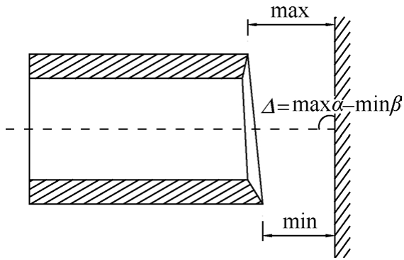

# 一般规定

顶管管材的横断面有圆形、矩形、其他形状。

适合于顶管的管材类型通常有：钢管、钢筋混凝土管、钢筒混凝土管、玻璃纤维塑料管或其他管材等。

钢筋混凝土管材的单节长度以2.0～3.0m为宜，钢管的单节长度以4～10m为宜，长距离顶管的管节长度可适当增加，曲线顶管的管节长度应根据曲线半径确定。

管材椭圆度：管节同一横断面上，互相垂直的最大直径与最小直径之差，应分别测量管材的插口椭圆度与承口椭圆度。

管端面垂直度：以垂直于管道中心轴的平面为基准面，分别测量管节二端距离基准面的距离，将这二个距离差视为管端面垂直度，见图5.1。如果没有可以参照的基准面做参考，可以假设将管道平面翻转180°，然后测量其与水平线的角度，除以2的值可以表示管端面垂直度。管道端面垂直度的误差应符合表5.1的要求。

<figure><figcaption>
图5.1 管端面垂直度的测量
</figcaption></figure>

<table data-full-width="true"><thead><tr><th align="center">直径</th><th align="center">混凝土管</th><th align="center">钢管</th><th align="center">玻璃纤维管</th></tr></thead><tbody><tr><td align="center">300≤D≤600</td><td align="center">2</td><td align="center">1</td><td align="center">1.5</td></tr><tr><td align="center">600&#x3C;D&#x3C;1200</td><td align="center">3</td><td align="center">2</td><td align="center">2.0</td></tr><tr><td align="center">1200≤D&#x3C;3000</td><td align="center">4</td><td align="center">3</td><td align="center">2.5</td></tr><tr><td align="center">3000≤D</td><td align="center">5</td><td align="center">-</td><td align="center">-</td></tr></tbody></table>

